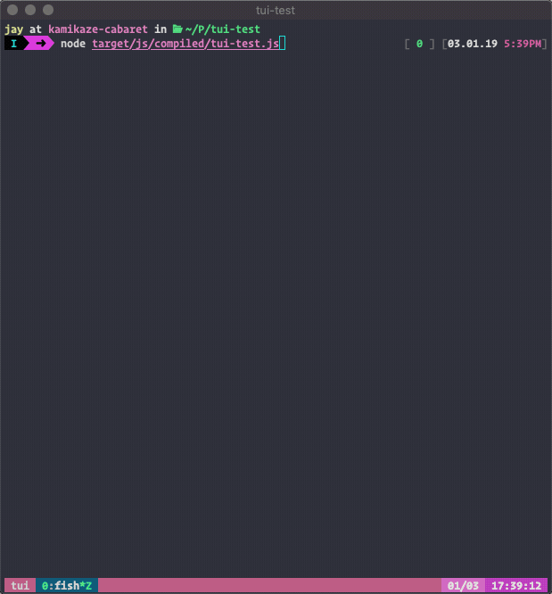

# ClojureScript Terminal-User-Interface Template

[![CLJS TUI Template Build Status][circle-shield]][circle-url] [![CLJS TUI Template on Clojars][clojars-shield]][clojars-url] [![Discuss with Clojurians on Zulip][zulip-shield]][zulip-url]

Create rich Terminal-User-Interface (TUI) apps in ClojureScript using web technologies you already know.

<p align="center">
  <a href="./doc/cljs-tui-demo.gif"></a>
</p>

## Table of Contents

1. [Quick Start](#quick-start)
2. [Features](#features)
3. [What's included?](#whats-included)
4. [Usage](#usage)
5. [Getting Started](#getting-started)
6. [Dependencies and Further Information](#dependencies-and-further-documentation)
7. [Frequently Asked Questions](#faqs)
8. [Credits](#credits)
9. [Thanks](#thanks)
10. [Support](#support)
11. [Contributing](#contributing)
12. [License](#license)


## Quick Start

Getting started is easy. Assuming you have [node][node-url], [clojure][clojure-url], and [lein 2][lein-url] installed:

```shell
lein new cljs-tui my-test-project
cd my-test-project
npm run init
```

Once the ClojureScript builds run it in another terminal window:
```shell
node --inspect target/js/compiled/my-test-project.js
```

You should now see the demo UI from the gif above.

## Features

### Develop rich apps, live with ClojureScript

#### Re-render on Save

[![cljs-tui save demo][save-url]][save-url]

Change a view within a ClojureScript source file, save it, and the build server will automatically re-build your app and re-render your views without losing state. Ideal when developing nested views.

#### Instant changes from REPL

[![cljs-tui REPL demo][repl-url]][repl-url]

Connect your editor to the nREPL server and send code changes to your running app without even saving a file. Ideal for changing application state, redefining functions, or debugging.

### Use web technologies you already know

- Write views in React with the ClojureScript Reagent wrapper.
- Reagent views compose together just like React components

### Create rich applications

- Use Reagent atoms for simple, local state updates
- Use Reframe for handling effects and updating shared app state
- Leverage functional programming and data-oriented design to the fullest for a fast feedback cycle.

### Distribute your applications

Transpile ClojureScript into vanilla JS and distribute your application on NPM for easy installation and quick startup times.

## What's included?

Upon generating an app from this template the following resources will be available with slight differences depending on the build tool you choose.

```
<root>
|- bin/
|  |- <project-name>       - A JS script to run your compiled app as a npm binary
|- docs/
|  |- intro.md             - A docs into template
|- env/
|  |- <project_name>/
|  |  |- debug/views.cljs  - A debug view to display current state and captured text output
|  |  app.cljs             - Development app entrypoint. Handle reloading, re-rendering, and initializing the debug views
|  |- dev/user.clj         - Only for figwheel based builds
|- scripts/
|  |- build                - A bash script for creating a production build
|- src/
|  |- <project_name>/
|  |  |- demo/
|  |  |  |- views.cljs     - Demo app views. You can do whatever you want with these
|  |  |- core.cljs         - Initialize the stateful application dependencies like reframe, reagent, and blessed
|  |  |- events.cljs       - Re-frame event handlers and intercepters to update app state db
|  |  |- keys.cljs         - Utils for handling key presses and global keyboard event handlers
|  |  |- main.cljs         - Production app entrypoint
|  |  |- subs.cljs         - Re-frame subscriptions to app state db
|  |  |- views.cljs        - General views such as a primitive router and vertical menu components
|- test/
|  |- <project_name>/
|  |  |- core_test.cljs    - A sample test. Should fail until fixed
|  |  |- test_runner.cljs  - Figwheel builds only. Runs tests and ensures proper exit codes for CI
|- .gitignore
|- .hgignore
|- CHANGELOG.md
|- dev.cljs.edn            - Figwheel-main development config.
|- figwheel-main.edn       - Figwheel-main config only
|- LICENSE
|- package.json            - Used to manage your npm modules and config for publishing to npm
|- prod.cljs.edn           - Figwheel-main production config
|- project.clj             - Figwheel builds only
|- README.md
|- shadow-cljs.edn         - Shadow-cljs builds only. ClojureScript build configuration
```

---

## Usage

### Generating a project template

```
lein new cljs-tui <project-name> [+<build-tool>]
```

Generate a demo cljs-tui application for the specified build-tool.

Supported `build-tool` options:

`+shadow` (default)

[http://shadow-cljs.org/][shadow-url]

Generate a ClojureScript Terminal-User-Interface app template using [shadow-cljs][shadow-url]. This is the default build-tool.

---

`+figwheel-main`

[https://figwheel.org/][figwheel-main-url]

Generate a ClojureScript Terminal-User-Interface app template using [figwheel-main][figwheel-main-url].

---

`+lein-figwheel`

[https://github.com/bhauman/lein-figwheel][lein-figwheel-url]

Generate a ClojureScript Terminal-User-Interface app template using [lein-figwheel][lein-figwheel-url].

---

## Getting Started

The following steps work for any supported build tool you choose. The tool specific commands have been placed into the project `package.json` scripts to make the commands consistent between each tool.

All of the following commands assume you are running them in a terminal from the root directory of your generated project.

### Installing dependencies

To get started, install the required npm modules into a local node_modules folder.

```
npm install
```

---

### Build for development

Start a development build server to watch your files for changes and automatically recompile and reload your app. Your re-frame app state will remain the same but the UI will re-render allowing you to make changes to components deeper into a flow without a tedious manual testing process.

```
npm start
```

---

### Running your app

When a development build is first finished the generated JS file is written to `target/js/compiled/<project-name>.js`. You can execute the following program to start your app and connect to the development server and\\or REPL:

```
node --inspect target/js/compiled/<project-name>.js
```

---

### Build for production

When you are ready to release your app you will need to do a production build to produce a smaller JS footprint and build a single file the project's `bin/<project-name>` file will be able to find and use.

```
npm run build
```

This will build your ClojureScript app for production, run loose-envify to ensure your code runs in a production environment, and finally moves the compiled JS file to the lib folder as an npm convention. The build process can be found in the scripts/build file in your generated project folder.

---

### Updating NPM dependencies

Your npm modules are managed through your project's `package.json` file. There are two common ways to update your project's deps.

#### NPM CLI

Run the following in the project directory:

```
npm install --save [@scope/]<package-name>[@<version>]
```

Example:

```
npm install --save highland
```

You can find more at [npm's install docs](https://docs.npmjs.com/cli/install)

#### Manual

1. Update your package.json file `dependencies` map.
2. Save your updated package.json.
2. Run `npm install`

#### Using NPM modules

To use a npm module in ClojureScript use JS interop require:

```clojure
(def stream (js/require "highland"))
```

---

### Updating Clojure dependencies

Clojure dependencies are handled a bit differently and vary a bit between figwheel and shadow-cljs projects.

After updating your dependencies it's recommended to restart your build server.

#### figwheel-main or lein-figwheel

Update the dependencies map in your project's `project.clj` file.

#### shadow-cljs

Update the dependencies map in your project's `shadow-cljs.edn` file.

---

### Working with nREPL

All supported build tools do offer an nREPL server option if you would like to develop against the live state of your app. However, the process differs between build tools.

Both figwheel-main and lein-figwheel have an extra development file located in `env/dev/user.clj` which defines a `(start)` and `(repl)` function for working with nREPL.

#### Starting a nREPL server with figwheel-main or lein-figwheel

1. Shutdown any running build servers, we're going to run them from the REPL.
2. Run `npm run repl`
3. When the Clojure REPL loads eval `(start)` to start the build server, nREPL server, and ClojureScript REPL interface.
4. Once your application compiles, run the compiled node app in another terminal to initialize the ClojureScript REPL:
   ```
   node --inspect target/js/compiled/<my-project>.js
   ```

 ---

#### Starting a nREPL server with shadow-cljs

Amazingly, shadow-cljs starts an nREPL server automatically when you run the build server. When the build server starts it creates an .nrepl-port file most Clojure editor REPL plugins can use to connect with.

---

#### Connecting your editor to the REPL

You can use the .nrepl-port file to connect to the running nREPL server. Note when you connect it will be in Clojure and not ClojureScript. You can enter the ClojureScript REPL by evaluating the following form:

```clojure
user=> (repl)
```
---

This behavior is defined in `env/dev/user.clj` and can be customized with your chosen build-tool's API.

### Testing

To run tests run the command following from your project directory:

```
npm test
```

This will compile the test build, run the test runner, which will asynchronously run the imported tests files and print the results. The test runner will exit in a non-zero exit code if the tests fail making it compatible with various continuous integration (CI) services. In the near future I would like to setup auto testing so tests rerun upon save.

---

## Dependencies and Further Documentation

This template makes use of many open source projects which may have more docs to support your development with a bigger community behind it.

### Clojure

| Name                                                      | Description                                      |
| --------------------------------------------------------- | ------------------------------------------------ |
| [Clojure](https://clojure.org)                            | Base tooling runs on Clojure                     |
| [ClojureScript](https://clojurescript.org)                | Language of choice for this template             |
| [figwheel-main](https://figwheel.org)                     | One of the supported cljs build tools            |
| [leiningen](https://github.com/technomancy/leiningen)     | Clojure\ClojureScript project management         |
| [lein-figwheel](https://github.com/bhauman/lein-figwheel) | Another cljs build tool option, leiningen plugin |

### Clojure \\ ClojureScript

| Name                                              | Description                                       |
| ------------------------------------------------- | ------------------------------------------------- |
| [Mount](https://github.com/toltitus/mount)        | Used to manage stateful dependencies              |
| [Reagent](https://reagent-project.github.io/)     | ClojureScript view layer                          |
| [Reframe](https://github.com/Day8/re-frame)       | Manages application state and side effects        |
| [tools.cli](https://github.com/clojure/tools.cli) | Parse CLI args into hash-maps                     |


### npm modules

| Name                                                                    | Description                                       |
| ----------------------------------------------------------------------- | ------------------------------------------------- |
| [Blessed](https://github.com/chjj/blessed)                              | Abstraction layer over terminal UI                |
| [Create-React-Class](https://www.npmjs.com/package/create-react-class)  | Bridge react and reagent                          |
| [React](https://reactjs.org/)                                           | nodejs view layer                                 |
| [React-Blessed](https://github.com/Yomguithereal/react-blessed)         | Blessed backend for React views                   |
| [React DOM](https://npmjs.com/package/react-dom)                        | Required by reagent                               |
| [Shadow CLJS](http://shadow-cljs.org/)                                  | Default build tool, manages builds, compiles cljs |

---

## FAQs

### Why ClojureScript?

I really enjoy working with ClojureScript, it's been a fun, productive, and empowering experience so far. My reasoning can be found in the [announcement blog post][blog-url].

---

### Why is Shadow the default build-tool?

After working with all three tools, shadow-cljs provides the smoothest development experience, great docs, and fewest layers. I covered this more in the [announcement blog post][blog-url].

---

### Does this template support boot?

Currently this template only supports leiningen. However, the shadow-cljs build option does not use leiningen or boot at all. Please create an issue if supporting boot would be of interest to you. :smile:

---

## Credits

In early 2019 I saw this link on Reddit in [r/clojure](https://www.reddit.com/r/Clojure/comments/aaora1/an_edn_browser_for_the_terminal_written_in_reframe/):

https://github.com/denisidoro/floki

Denis Isidoro created this beautiful terminal-user-interface JSON explorer app using ClojureScript, Reagent, React, and Blessed. It completely blew my mind! This template would not exist without him or his work on Floki.

---

## Thanks

Big thanks to the Clojurians on Slack and Zulip! They've endured countless beginner Clojure and ClojureScript questions to help put this project together.

Also shout out to [VenueBook](https://venuebook.com) for supporting my development efforts of this open-source project.

---

## Support

Please create issues on related dependencies unless it is specific to this template. The library communities are more active and have more support resources. If you do run into problems with this template please create an issue on this repo. For the quickest response, share your issue or questions in the [cljs-tui-template topic][zulip-url] on the Clojurians Zulip chat.

---

## Contributing

Contributors are welcome, please create pull requests or file issues if you would like to discuss it first. There's a lot of potential in this project and it would be better to provide more library views for prototyping apps quickly.

---

## License

Copyright © 2019 Jay Zawrotny

Licensed under the Apache License, Version 2.0 (the "License");
you may not use this file except in compliance with the License.
You may obtain a copy of the License at

    http://www.apache.org/licenses/LICENSE-2.0

Unless required by applicable law or agreed to in writing, software
distributed under the License is distributed on an "AS IS" BASIS,
WITHOUT WARRANTIES OR CONDITIONS OF ANY KIND, either express or implied.
See the License for the specific language governing permissions and
limitations under the License.

[blog-url]: https://eccentric-j.com/blog/5-announcing-cljs-tui-template.html
[circle-shield]: https://circleci.com/gh/eccentric-j/cljs-tui-template.svg?style=svg
[circle-url]: https://circleci.com/gh/eccentric-j/cljs-tui-template
[clj-url]: https://clojure.org/
[cljs-url]: https://clojurescript.org/
[clojars-shield]: https://img.shields.io/clojars/v/cljs-tui/lein-template.svg
[clojars-url]: https://clojars.org/cljs-tui/lein-template
[clojure-url]: https://clojure.org/guides/getting_started
[figwheel-main-url]: https://figwheel.org/
[lein-figwheel-url]: https://github.com/bhauman/lein-figwheel
[lein-url]: https://github.com/technomancy/leiningen#installation
[node-url]: https://nodejs.org/en/download/current/
[nrepl-url]: https://nrepl.org/nrepl/0.6.0/index.html
[repl-url]: ./doc/cljs-tui-repl-demo.gif
[save-url]: ./doc/cljs-tui-save-demo.gif
[shadow-url]: http://shadow-cljs.org/
[zulip-shield]: https://img.shields.io/badge/clojurians%20zulip-clojure-brightgreen.svg
[zulip-url]: https://clojurians.zulipchat.com/#narrow/stream/151168-clojure/topic/cljs-tui-template
